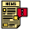

# RETRO.FEED 🌐

A cyberpunk-themed news aggregator that transforms modern news into a retro-futuristic experience. Built with React, TypeScript, and TailwindCSS, RETRO.FEED delivers news with a unique aesthetic inspired by 80s computer terminals and cyberpunk interfaces.



_Experience news in a retro-futuristic style inspired by cyberpunk aesthetics!_

---

## ⚡ Key Features

### 🎮 Retro Interface

- CRT screen simulation with scan lines and flicker effects.
- Pixel-perfect typography using the "Press Start 2P" font.
- Neon color scheme with dynamic glow effects.
- Retro boot sequence animation for a fully immersive experience.

### 📰 News Categories

- 🌍 **Global**: International news coverage.
- 🇮🇳 **India News**: Domestic Indian news coverage.
- 🛡️ **Defense**: Military and defense news.
- 💣 **Conflicts**: Current global conflicts.
- ⚖️ **Politics**: Political updates and coverage.
- 📰 **Technology**: Latest tech news and updates.

### 🔧 Technical Features

- Responsive design ensures a seamless experience on all devices.
- Article content extraction and cleaning for optimized readability.
- Smart image selection algorithm to match articles.
- Fallback proxy system for reliable content fetching.
- Error handling with retro-styled error messages.

---

## 🚀 Quick Start

### Prerequisites

Before you begin, ensure you have the following installed:

- **Node.js**: Version 16.x or higher.
- **npm** or **yarn**: Package manager.
- A modern web browser.

### Installation

1. **Clone the repository**:
   ```bash
   git clone https://github.com/your-username/retro-feed.git
   ```
2. **Navigate to the project directory**:
   ```bash
   cd retro-feed
   ```
3. **Install dependencies**:
   ```bash
   npm install
   # or
   yarn install
   ```

### Running the Application

1. **Start the development server**:

   ```bash
   npm run dev
   # or
   yarn dev
   ```

2. **Open in your browser**:  
   Visit [http://localhost:3000](http://localhost:3000) to view the app.

### Building for Production

To create a production build:

```bash
npm run build
# or
yarn build
```

The optimized files will be located in the `dist` directory.

---

## 🎨 Design Inspiration

The design of RETRO.FEED draws heavily from:

- **Cyberpunk aesthetics**: Neon colors, dark themes, and tech-inspired layouts.
- **80s computer terminals**: CRT effects, pixel fonts, and vintage graphics.

---

## 🌟 Contribution

Contributions are welcome! Please follow these steps:

1. **Fork the repository**.
2. **Create a feature branch**:
   ```bash
   git checkout -b feature-name
   ```
3. **Commit your changes**:
   ```bash
   git commit -m "Add feature description"
   ```
4. **Push to your fork**:
   ```bash
   git push origin feature-name
   ```
5. **Open a Pull Request** on the main repository.

---

## 📜 License

This project is licensed under the MIT License. See the [LICENSE](LICENSE) file for details.

---

## 📧 Contact

For inquiries or suggestions, feel free to reach out:

- **Email**: cb2117@srmist.edu.in
- **GitHub**: [@BrightEyeKid](https://github.com/BrightEyeKid)

---

Enjoy exploring the retro-futuristic world of news with **RETRO.FEED**! 🚀
